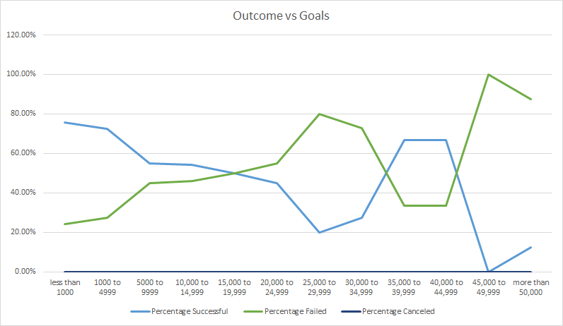
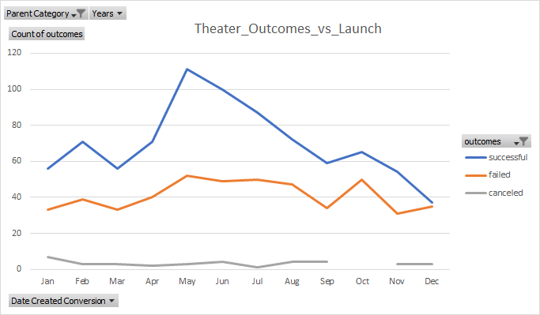

# Module 1
## Kickstarting with Excel

## Data

4115 x 21 size of data in Excel

## Analysis and Challenges

Given the large amount of data, it is interesting to find out certain trend by using Pivot Table.  While the trend is not clearly visible, it is easy to explain some tendency.

### Analysis of Outcomes Based on Launch Date

The successful results of the outcome depends on the start of the the launch date. Interestingly, if the launch date is from April to August, the projects may have a higher chance of success: higher number of success and higher number of participation.

### Analysis of Outcomes Based on Goals

The first challenge is to understand the relationship of success and failure.  It seems success and failure are reciprocal.  But overall, if the goal is smaller dollar, there is a higher chance to succeed.  It is easy to understand that it is easy to ask for a smaller amount of donation than the larger amount.

### Challenges and Difficulties Encountered

One problem that I have not figured out is that there are 694 successful cases; but in the break-down column, there is only 693 cases. I have no solution to this result.

## Results

- What are two conclusions you can draw about the Outcomes based on Launch Date?
  - Success and Failure are negatively correlated.  At a certain goal, success is significantly higher than failure.  On the other hand (ex, goal of 45,000) it is almost a 100% failure and 0% success.
  - During the warm months of April to August, the participation number (total) are more than other months.
  
  
   
- What can you conclude about the Outcomes based on Goals?
  - The trend is that it is easier and more successful if the goal is smaller.
  - "Canceled" should be counted as failure.
  
  
   
- What are some limitations of this dataset?
  - The limitation of the dataset is the consumer's preference. We don't know how much they like it when they payed or why they canceled.
- What are some other possible tables and/or graphs that we could create?
  - We can create tables/graphs to show the relationship between backers (supporters) and rate of success
  - We can compare the rate of success or failure between countries.
